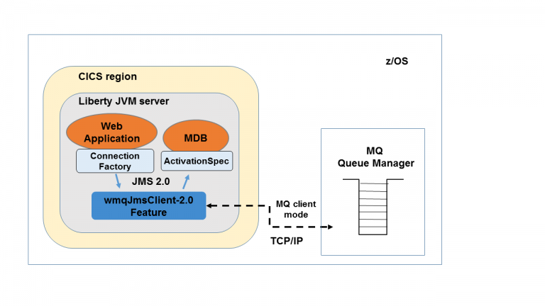
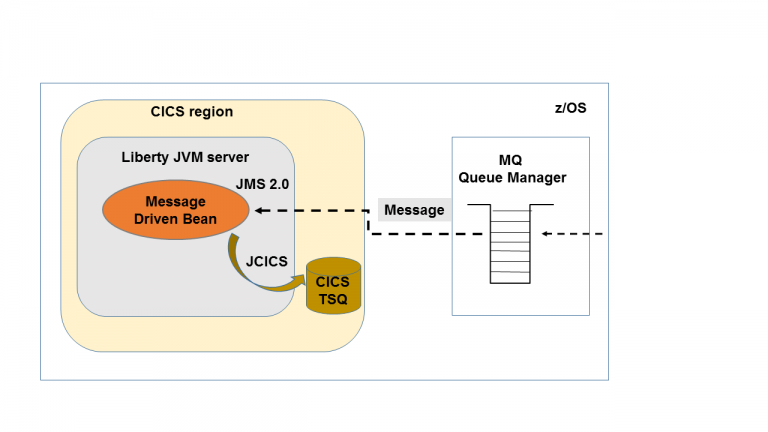
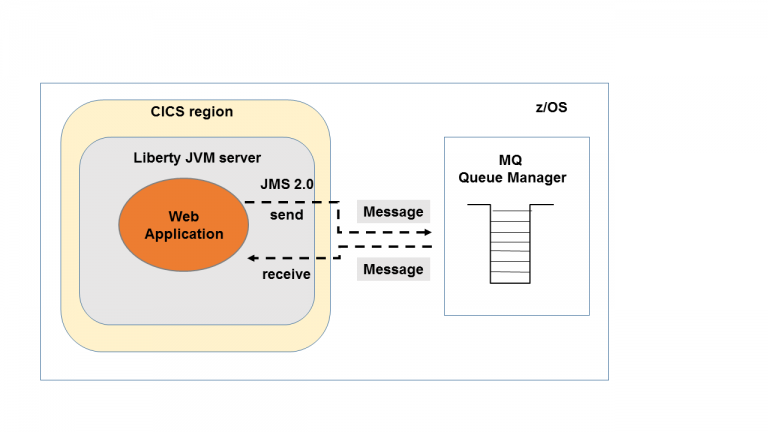

Developing an MQ JMS application for CICS Liberty
=================================================

Author: Phil Wakelin

*In this article we show how to create a JMS application using either a
message-driven bean (MDB) that receives incoming messages from an IBM MQ
queue manager or a servlet that uses a JMS connection factory to send
and receive JMS messages. This is based on the JMS 2.0 support now
available with the Liberty wmqJmsClient-2.0 feature in CICS TS V5.3 and
V5.4 as part of Java EE 7 Full Platform.*

## What is JMS?

Java Message Service (JMS) is an API defined by the Java Enterprise
Edition (Java EE) specification that allows applications to send and
receive messages using reliable, asynchronous communication. Liberty
supports both the JMS 1.1 and JMS 2.0 versions of the specification. It
provides the ability to use a range of messaging providers including IBM
MQ, the WebSphere Liberty embedded JMS messaging provider or a third
party messaging provider. JMS 2.0 is the latest version of the
specification and provides for a *simplified* API over the *classic* JMS
1.1 API. The IBM MQ V9 JMS resource adapter is required to use JMS in
CICS Liberty, and can be used to connect to a IBM MQ V7, V8 or V9 queue
manager. The V9 resource adapter only supports JMS 2.0, but applications
written to the JMS 1.1 API can also be deployed into a JMS 2.0
environment such as provided in CICS Liberty.




## Using JMS in CICS with IBM MQ

There are three potential ways of connecting to IBM MQ from a CICS JVM
server.

1.  MQ client mode -- via a TCP/IP network connection to a queue manager
2.  MQ bindings mode -- via a local cross memory interface to the queue
    manager, using the MQ RRS adapter
3.  CICS MQ adapter and MQCONN -- via a local cross memory interface to
    the queue manager, using the CICS MQ adapter

> In addition to IBM MQ, the JMS client support in Liberty can also be
> used to connect to an embedded JMS messaging provider hosted in
> WebSphere Application Server or in Liberty. For further details on
> this option see [Liberty embedded JMS messaging
> provider.](https://www.ibm.com/support/knowledgecenter/SS7K4U_liberty/com.ibm.websphere.wlp.zseries.doc/ae/cwlp_msg_embedded.html)

There are 3 different JVM server environments in CICS that support JMS,
as follows:

1.  Liberty JVM server (integrated mode) -- This provides managed JMS
    connection factories and MDB support along with integrated CICS
    transactions and security.
2.  Liberty JVM server (standard mode) -- This provides managed JMS
    connection factories and MDB support but without integrated CICS
    transactions.
3.  OSGi JVM server -- This supports non-managed JMS connection
    factories with integrated CICS transactions and security and is
    discussed further in the article [Using MQ JMS in a CICS OSGi JVM
    server.](https://github.com/cicsdev/blog-cics-java-mq-jms-osgi/blob/master/blog.md)


The following table summarizes the current JMS API support for IBM MQ
across the different CICS Java environments:


  |**MQ connectivity** |         **Liberty -- Integrated mode** |  **Liberty -- Standard mode** |  **OSGi JVM server** |
  |----------------------|-------------------------------------|------------------------------|---------------------|
  |MQ -- client mode      |      JMS 1.1 & JMS 2.0       |         JMS 1.1 & JMS 2.0      |        n/a|
  |MQ -- bindings mode      |    n/a               |               JMS 1.1 & JMS 2.0   |           n/a|
  ||CICS MQ adapter and MQCONN  | n/a        |  n/a   |                        JMS 1.1 & JMS 2.0|


In this article we use the Liberty JVM server running in integrated-mode
with an MQ client mode connection over TCP/IP to a queue manager on the
same z/OS system. All the sample code from this article is available in
the
[cics-java-liberty-mq-jms](https://github.com/cicsdev/cics-java-liberty-mq-jms)
CICSDev Git repository.

## MDB sample application

Our sample MDB application provides a message driven bean called
[MySimpleMDB](https://github.com/cicsdev/cics-java-liberty-mq-jms/blob/master/projects/com.ibm.cicsdev.mqjms.mdb/ejbModule/com/ibm/cicsdev/mqjms/mdb/MySimpleMDB.java)
that receives messages from an MQ queue and writes the message body to a
CICS temporary storage queue (TSQ).



### Creating an MDB

An MDB is implemented in Eclipse using an EJB project, so first of all
we need to create an EJB project and then you can simply add an MDB
using the Eclipse wizard **New -\> Message-Driven Bean (EJB 3.x)**. In
the resulting dialog ensure you check **JMS** to specify that the MDB is
a JMS message type, and then select the **Destination type** as
**Queue** . The resulting generated class should look similar to the
following code and the key lines are explained below.

```java
@MessageDriven(activationConfig = { @ActivationConfigProperty(propertyName = "destinationType", propertyValue = "javax.jms.Queue") })
public class MySimpleMDB implements MessageListener {

    public MySimpleMDB() {
    }

    public void onMessage(Message message) {        

    }

}
```

- The Class MySimpleMDB implements the `javax.jms.MessageListener` interface marking the EJB as an MDB.
- The `activationConfig` annotation `destinationType` property is set to `"javax.jms.Queue"` signifying the use of point-to-point messaging.
- The the `onMessage()` method in the MDB will be invoked by the EJB container each time a message arrives on the queue associated with the MDB. A
`javax.jms.Message` object is then passed as input to the MDB for further processing.

### Message headers

The first processing our MDB performs is to analyze some of the message
headers. The JMS API provides access to the message header fields such
as the destination, delivery mode, reply queue and so on. Each of these
has its own JMS field, and these map to MQMD and MQRFH2 fields as
documented
[here](https://www.ibm.com/support/knowledgecenter/en/SSFKSJ_9.0.0/com.ibm.mq.dev.doc/q032060_.htm).

```java
        try {
            Destination jmsDestination = message.getJMSDestination();
            if (jmsDestination != null) {
                q = ((Queue) jmsDestination).getQueueName();
                System.out.println(formatTime() + " JMS message received by MDB from queue: " + q);
            } else {
                System.out.println(formatTime() + " MQ message received by MDB ");
            }
        } catch (JMSRuntimeException | JMSException e) {
            msgErr = " ERROR: JMS error getting destination: " + e.getLocalizedMessage();
            throw new RuntimeException(msgErr, e);
        }    
```

- The `getJMSDestination()` method on the JMS message is used to obtain the Destination and then obtain the input queue name using the
`getQueueName()` method on the Destination.
- The absence of the `Destination` is used to determine if the message has come from an MQ API client or a JMS application. If using an
MQ API client then the Destination will be `null`.
- The try/catch block handles both a `JMSException` and a `JMSRuntimeException` from the JMS API, although only the `JMSException`
is a mandatory checked Exception. This is a change in JMS 2.0 in that much of the JMS API now throws the unchecked exception
`JMSRuntimeException` rather than the checked `JMSException` so it's good practice to test for both when using JMS 2.0.

### Message properties
Message properties consisting of a name/value pair are a standard way of
passing metadata with messages. They are often used by message consumers
to selectively get messages from queues. In our application, the message
property (if set) will determine the name of the CICS TSQ to which the
message body will be written.

```java
private static final String TSQNAME = "RJMSTSQ";
...
String TSQname = message.getStringProperty("TSQNAME");
if (TSQname == null) {
    TSQname = TSQNAME;
}
TSQ tsqQ = new TSQ();
tsqQ.setName(TSQname)
tsqQ.writeString(msgBody);
```

- The `Message.getStringProperty()` method is used to read the message property named `"TSQNAME"` from the message.
- The `TSQNAME` property defines the name of the CICS TSQ that is used to store the message body, and if not present defaults to the
static value "RJMSTSQ"
- The message body is then written to the TSQ using the JCICS `TSQ class and the `writeString()` method.

### Transactions
An MDB is a type of EJB and so can use either container or bean managed
Java transactions. In our MDB we add the `@TransactionAttribute`
annotation to the `onMessage()` method with the
`value=TransactionAttributeType.REQUIRED` to define this method as
always being part of a container-managed Java transaction. When used
within a CICS Liberty JVM server this will *require* a Java transaction
to be used to control both the Liberty managed resources and the CICS
unit-of-work. This means that the `commit()` method on the
`JMSContext()` can not be used to commit updates to the queue manager,
as they are controlled by the Liberty Transaction Manager. For our MDB
using the `TransactionAttributeType.REQUIRED` this means that both the
read from the JMS queue and the write to the CICS TSQ are part of the
same global transaction, and will commit or rollback together providing
the TSQ is defined as recoverable to CICS.

For further details on the Java Transaction API (JTA) support in CICS
see [Using Java Transactions in CICS Liberty to coordinate JDBC
updates](https://github.com/cicsdev/blog-cics-java-jta-jdbc/blob/master/blog.md).

```java
    @TransactionAttribute(value = TransactionAttributeType.REQUIRED)
    public void onMessage(Message message) {
        ....
    }
```

> The CICS transaction ID under which the MDB request will run defaults
> to CJSU, which is the JVM server unclassified request processor. This
> can be modified per JVM server using the system property
> `com.ibm.cics.jvmserver.unclassified.tranid`.

### Testing the MDB sample
To test the MDB sample, download the code from the Git repository
[cics-java-liberty-mq-jms](https://github.com/cicsdev/cics-java-liberty-mq-jms)
and perform the following actions to configure the Liberty JVM server as
detailed in the repository readme.

**1.** Download the MQ V9 resource adapter from [Fix
Central](https://www.ibm.com/support/docview.wss?uid=swg21633761) to
zFS and define in the Liberty server.xml using the variable element.

```xml
<variable name="wmqJmsClient.rar.location" value="/u/cics1/RARs/wmq.jmsra.rar"/>
```

**2.** Add the wmqJmsClient-2.0 and mdb-3.2 features to the Liberty
feature manager list in the server.xml configuration file.

```xml
<feature>wmqJmsClient-2.0</feature>
<feature>mdb-3.2</feature>
```

**3.** Define a jmsQueue in the Liberty server.xml referencing the MQ
queue DEMO.MDBQUEUE via the baseQueueName property.

```xml
<jmsQueue id="jms/mdbq" jndiName="jms/mdbq">
    <properties.wmqJms baseQueueName="DEMO.MDBQUEUE" />
</jmsQueue>
```

**4.** Define a jmsActivationSpec in the Liberty server.xml referencing
the jmsQueue element, the channel, queue manager, host, port and
transport type as shown below. The jmsActivationSpec id attribute must
be in the format of application name/module name/bean name, and is
output in the Liberty messages.log in the CNTR0180I message.

```xml
    <jmsActivationSpec id="com.ibm.cicsdev.mqjms.mdb.ear/com.ibm.cicsdev.mqjms.mdb/MySimpleMDB">
        <properties.wmqJms
            channel="WAS.JMS.SVRCONN"
            destinationRef="jms/mdbq"
            destinationType="javax.jms.Queue"
            hostName="<hostname>"
            port="<port>"
            queueManager="<queue_manager>"
            transportType="CLIENT" />
    </jmsActivationSpec>  

```

The `transportType` property must be set to the value "CLIENT" to ensure
the MQ client mode transport is used. For full details on the IBM MQ
properties you can set on the jmsActivationSpec refer to the
`properties.wmqJms` attribute in the WebSphere Application Server for
z/OS Liberty [Knowledge
Center](https://www.ibm.com/support/knowledgecenter/SS7K4U_liberty/com.ibm.websphere.liberty.autogen.zos.doc/ae/rwlp_config_jmsActivationSpec.html).

**5.** Lastly deploy the sample MDB application using the supplied CICS
bundle project com.ibm.cicsdev.mqjms.mdb.cicsbundle and a CICS bundle
resource definition as described in the readme.

You can now test the MDB is invoked by writing a message to the MQ queue
named in the activation spec. This can be achieved either by either
installing the MQJMSDemo servlet described in the JMS Connection Factory
sample [section](#MQJMSDemo) of this article, or by using the [IBM MQ
sample client
program](https://www.ibm.com/support/knowledgecenter/en/SSFKSJ_9.0.0/com.ibm.mq.dev.doc/q024260_.htm)
**amqsputc** installed on a remote workstation.

*i.* To use the **amqsputc** you first need to set the MQSERVER
environment variable to define the MQ channel, connectivity protocol,
and IP endpoint. You can then simply write to the queue as follows as
shown below.

```
    > set MQSERVER=WAS.JMS.SVRCONN/TCP/<hostname(port)>
    > amqsputc DEMO.MDBQUEUE
    > hello
```

*ii.* To use the MQJMSDemo servlet to write to the MDB queue you can use
a URL as follows:
[http://host:port/jmsweb?test=putmdbq](http://host:port/jmsweb?test=putmdbq)

Having written to the DEMO.MDBQUEUE the string "hello" should now have
been passed in the JMS message body and have been written to the TSQ
RJMSTSQ. This can be verified in CICS using the CEBR queue browsing
transaction. Alternatively you can install the MQJMSDemo servlet which
can read the CICS TSQ.

## JMS Connection Factory sample



The JMS connection factory sample provides a servlet called
[MQJMSDemo](https://github.com/cicsdev/cics-java-liberty-mq-jms/blob/master/projects/com.ibm.cicsdev.mqjms.cf.web/src/com/ibm/cicsdev/mqjms/cf/web/MQJMSDemo.java)
that uses a JMS connection factory to send and receive message to and
from an MQ queue called DEMO.SIMPLEQ. The servlet can also write
messages to the MDB queue DEMO.MDBQUEUE and read the CICS TSQ used in
the MDB test.

### Initialisation
When using a servlet the `init()` method runs once at servlet
initialization and so is a useful place to lookup the JNDI references
for the connection factory and queues that are required. In our servlet
these objects are defined as class instance variables, and so shared
between all servlet invocations.

```java
private static final String JMS_CF1 = "jms/qcf1";
private static final String JMS_SIMPLEQ = "jms/simpleq"
private static final String JMS_MDBQ = "jms/mdbq";
private static ConnectionFactory qcf;
private static Queue simpleq;
private static Queue mdbq;
....

public void init(ServletConfig config) throws ServletException {

        String errmsg;

        try {
            InitialContext ctx = new InitialContext();
            qcf = (ConnectionFactory) ctx.lookup(JMS_CF1);
            simpleq = (Queue) ctx.lookup(JMS_SIMPLEQ);
            mdbq = (Queue) ctx.lookup(JMS_MDBQ);

        } catch (NamingException ne) {
            errmsg = " ERROR: On JNDI lookup in servlet initialisation ";
            throw new ServletException(errmsg, ne);
        }
}
```

### Writing to the queue
The `putQ` method in our servlet is used to write a simple string to the
DEMO.SIMPLEQ queue.

```java
    public void putQ(HttpServletRequest request, HttpServletResponse response) throws ServletException, IOException {
        ...
        try (JMSContext context = qcf.createContext()) {    
            JMSProducer producer = context.createProducer();            
            producer.send(simpleq, cicsmsg);
            String title = "Message has been written to " + simpleq.getQueueName();
            printWeb(pw, title);            
        } catch (JMSException | JMSRuntimeException jre) {
            webmsg = "ERROR on JMS send " + jre.getMessage();
            throw new ServletException(webmsg, jre);
        }
    }
```

In a multi-threaded servlet environment it's good practice to ensure
that connections to the queue manager are pooled efficiently. Connection
pooling is handled by the MQ resource adapter, and connection handles
are obtained using the `createContext()` method on the connection
factory. Connection handles should be released (closed) as soon as
practical to ensure efficient connection pooling.

A `JMSContext` is created directly from the connection factory.
The JMSContext interface is new in JMS 2.0 and replaces the separate
`Connection `and `Session `objects in the JMS 1.1 API. The
`JMSContext `implements the Java 7 `java.lang.AutoCloseable` interface.
This means that since we create the `JMSContext` in a try-with-resources
block, the close method will be called automatically at the end of the
block without the need to explicitly close it.

A `JMSProducer` is a replacement for the MessageProducer object in
JMS 1.1. It allows message delivery options, headers, and properties to
be configured. It is created using the `createProducer()` method on the
`JMSContext`. The `putMDBQ()` method in our sample shows how to use the
`JMSProducer` to set message properties on a JMS message using in the
MDB test.

The `JMSProducer.send()` is used passing in the JMS queue and a
String message to be written to the queue. In the JMS 2.0 API there's no
need to create a `TextMessage` object and set its body to the specified
string. Instead, we can simply pass the string into the `send()` method.
The JMS provider will automatically create a JMS `TextMessage` and set
its body to the supplied string.

### Reading the queue
The `readQ()` method in our servlet is used to read the DEMO.SIMPLEQ queue as shown in the snippet below. 

```java
public void readQ(HttpServletRequest request, HttpServletResponse response) throws ServletException, IOException {
....

        try (JMSContext context = qcf.createContext()) {

            JMSConsumer consumer = context.createConsumer(simpleq);

            webmsg = "Records read from " + simpleq.getQueueName() + " are as follows:";
            printWeb(pw, webmsg);

            String txtmsg;
            for (int i = 0; i < QM_MAX_DEPTH_COUNT; i++) {
                txtmsg = consumer.receiveBodyNoWait(String.class);
                if (txtmsg != null) {
                    webmsg = "Record[" + i + "] " + txtmsg;
                    printWeb(pw, webmsg);
                } else {
                    break;
                }
            }
        } catch (JMSRuntimeException | JMSException jre) {
            webmsg = "ERROR on JMS receive " + jre.getMessage();
            throw new ServletException(webmsg, jre);
        }
}
```

The `JMSContext` is created in a try-with-resources block and obtains a connection from the underlying connection pool

When an application needs to receive messages it uses the `createConsumer()` method to create a `JMSConsumer` object.

The queue is then read in a loop until the maximum depth count is exceeded or no more data is returned.

The `receiveBodyNoWait(String.class)` method is called which will return the JMS message body as a string, if one is immediately available. Note that alternative versions of this method are available which will block for a specified timeout period.

### Deploying the servlet

To test the servlet sample, download the code from the Git repository
[cics-java-liberty-mq-jms](https://github.com/cicsdev/cics-java-liberty-mq-jms)
and then add the following elements to the Liberty server.xml, in
addition to the configuration for the previous MDB sample.

**1.** Add the JNDI feature to the Liberty feature manager list to
support the use of the `InitialContext.lookup()`.

```xml
<feature>jndi-1.0</feature>
```

**2.** Define the connection factory referencing the MQ queue manager
and channel, and the TCP/IP host and port on which the MQ channel is
listening. In addition add a connectionManager definition to define the
size of the connection manager pool. For full details on the IBM MQ
properties you can set on the jmsQueueConnectionFactory refer to the
*properties.wmqJms* attribute in the [WebSphere Application Server for
z/OS Liberty Knowledge
Center](https://www.ibm.com/support/knowledgecenter/SS7K4U_liberty/com.ibm.websphere.liberty.autogen.zos.doc/ae/rwlp_config_jmsQueueConnectionFactory.html).

```xml
<jmsQueueConnectionFactory connectionManagerRef="ConMgrJms" jndiname="jms/qcf1">
    <properties.wmqJms channel="WAS.JMS.SVRCONN"
        hostName="<hostname>"
        port="<port>"
        queueManager="<queue_manager>"
        transportType="CLIENT"/>
</jmsQueueConnectionFactory>
<connectionManager id="ConMgrJms" maxPoolSize="20"/>
```

> Note we use a jmsQueueConnectionFactory rather than the alternative
> jmsConnectionFactory as we only want to use point-to-point messaging
> and not JMS topics in our test.

**3.** Define the MQ queue DEMO.SIMPLEQ to be used by the servlet.

``` {.brush: .xml; .gutter: .false; .title: .; .notranslate title=""}
    <jmsQueue id="jms/simpleq" jndiName="jms/simpleq">
        <properties.wmqJms baseQueueName="DEMO.SIMPLEQ" />
    </jmsQueue>
```

**4.** Lastly deploy the sample web application using the supplied CICS
bundle project com.ibm.cicsdev.mqjms.cf.cicsbundle and a CICS bundle
resource definition as described in the readme.

Once the web application is installed, you can specify the following
query strings to drive the sample code discussed in this tutorial.

[http://host:port/jmsweb?test=putq](http://host:port/jmsweb?test=putq)
-- Write a message to the DEMO.SIMPLEQ\
[http://host:port/jmsweb?test=readq](http://host:port/jmsweb?test=readq)
-- Read messages from the DEMO.SIMPLEQ\
[http://host:port/jmsweb?test=putmdbq](http://host:port/jmsweb?test=putmdbq)
-- Write a message to the DEMO.MDBQUEUE used in the MDB test\
[http://host:port/jmsweb?test=readtsq](http://host:port/jmsweb?test=readtsq)
-- Read messages from the CICS TSQ used in the MDB test

## Summary
This article has covered the basics of JMS usage with IBM MQ in a CICS
Liberty JVM server, including the following topics:

-   The different JMS and MQ environments supported in CICS
-   How to create an MDB to read messages from a queue
-   How to use a JMS connection factory in a web application
-   Some of the benefits of the simplified JMS 2.0 API

## References

The following references provide more detailed information if you want
to explore the subject further.

- Oracle technetwork -- [What New in JMS 2.0](http://www.oracle.com/technetwork/articles/java/jms20-1947669.html)\
- CICS article -- [Using MQ JMS in an OSGi JVM server]https://github.com/cicsdev/blog-cics-java-mq-jms-osgi/blob/master/blog.md)\
- IBM MQ Knowledge Center -- [IBM MQ Classes for JMS -- Javadoc](https://www.ibm.com/support/knowledgecenter/en/SSFKSJ_9.0.0/com.ibm.mq.javadoc.doc/WMQJMSClasses/com/ibm/msg/client/jms/JmsContext.html)
- IBM MQ Knowledge Center -- [Using IBM MQ classes for JMS](https://www.ibm.com/support/knowledgecenter/en/SSFKSJ_9.0.0/com.ibm.mq.dev.doc/q031500_.htm)\
- IBM MQ Knowledge Center -- [Deploying message-driven beans within Liberty](https://www.ibm.com/support/knowledgecenter/en/SS7K4U_liberty/com.ibm.websphere.wlp.zseries.doc/ae/twlp_dep_msg_mdb.html)
- IBM CICS TS Knowledge Center -- [Using IBM MQ classes for JMS in a Liberty JVM server](https://www.ibm.com/support/knowledgecenter/SSGMCP_5.4.0/applications/developing/java/dfhpj_webspheremq_jmsliberty.html)

With thanks to Matthew Leming and Pete Siddall of IBM MQ development and Andy Wharmby of CICS Development.
